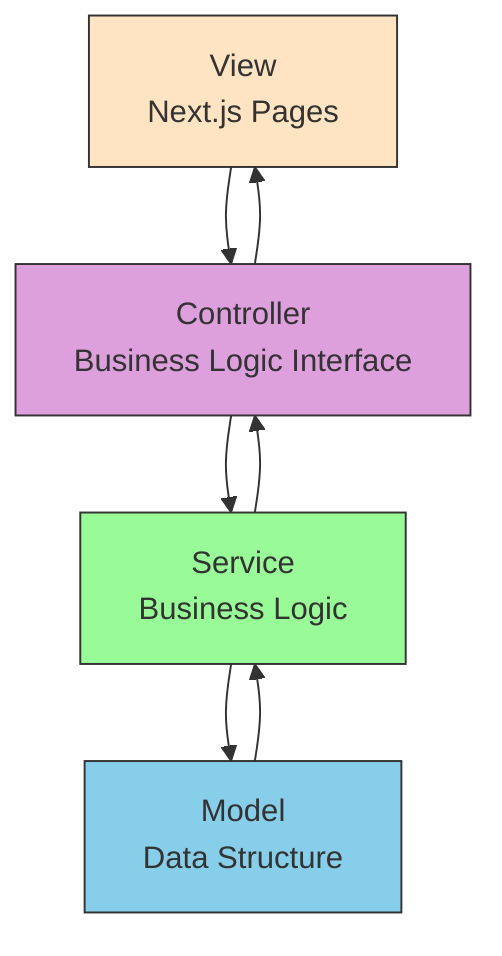

# MVC Architecture Diagram

## Component Responsibilities

### View (Next.js Pages)
- Render UI components
- Handle user interactions
- Communicate with controllers

### Controller
- Receive requests from views
- Validate input data
- Coordinate with services
- Return responses to views

### Service
- Implement business logic
- Handle data operations
- Manage data validation
- Provide clean APIs for controllers

### Model
- Define data structures
- Contain data validation logic
- Represent business entities